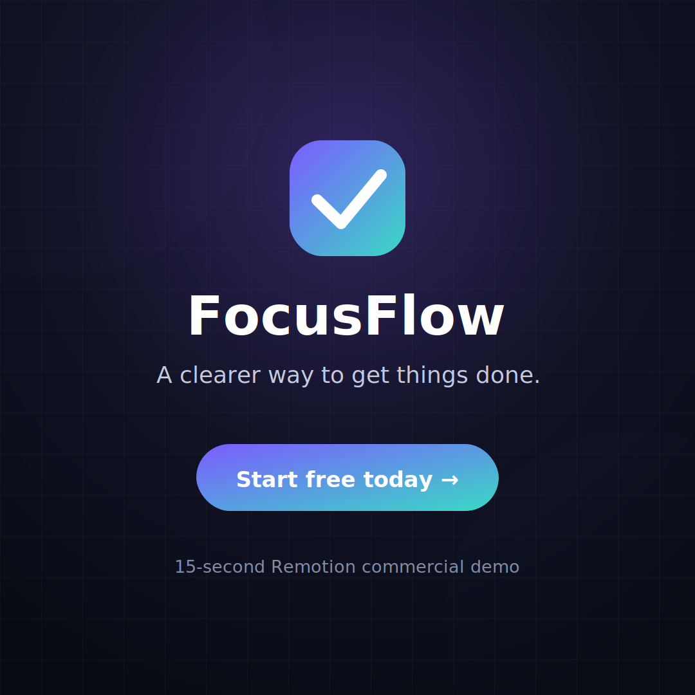

# Remotion Commercial

A complete, reusable 15-second animated product commercial built with [Remotion](https://www.remotion.dev/).

This demo advertises a fictional productivity app called **FocusFlow**. The video is generated with React and CSS, so the copy, colors, timing, music, and product UI can be changed without rebuilding the edit in a traditional timeline editor.



## Included

- 15-second commercial at 30 FPS
- Square composition: `1080 × 1080`
- Vertical composition: `1080 × 1920`
- Four scenes: hook, product demo, benefits, and call-to-action
- Animated text, app interface, cards, and transitions
- Background music and synchronized sound effects generated directly in code
- Editable props inside Remotion Studio
- Ready-to-render MP4 commands

## Run locally

```bash
npm install
npm start
```

Remotion Studio will open in the browser. Select either:

- `FocusFlowCommercial`
- `FocusFlowCommercialVertical`

## Render

Square commercial:

```bash
npm run render
```

Vertical commercial:

```bash
npm run render:vertical
```

Create a still image from the actual composition:

```bash
npm run still
```

Rendered files are saved in `out/`.

## Customize

Open `src/Commercial.tsx` or use the props panel in Remotion Studio. You can edit:

- Brand name
- Headline and subheadline
- Call-to-action
- Accent colors
- Background color
- Background music on/off

The initial values are stored in `defaultCommercialProps`.

## Audio

`src/audio.ts` creates the demo music, whoosh, and pop effects programmatically. This keeps the repository self-contained and ensures the effects remain aligned to the timeline.

## Add your own voice-over

1. Create `public/audio/voiceover.mp3` and place your recording there.
2. Import `staticFile` from `remotion`.
3. Add this inside the main `Commercial` component:

```tsx
<Audio src={staticFile('audio/voiceover.mp3')} volume={1} />
```

For a professional result, reduce the background-music volume while narration is playing.

## Structure

```text
remotion-commercial/
├── docs/
│   └── preview.svg      # Repository preview
├── src/
│   ├── audio.ts         # Generated music and sound effects
│   ├── Commercial.tsx  # Scenes, animations, props, and timeline
│   ├── Root.tsx        # Composition registration
│   └── index.ts        # Remotion entry point
├── package.json
├── remotion.config.ts
└── tsconfig.json
```

## Turn it into a real advertisement

Replace the demo product name and copy with your own product, logo, images, voice-over, music, offer, and animation instructions. Remotion then acts as the programmable editing timeline.
